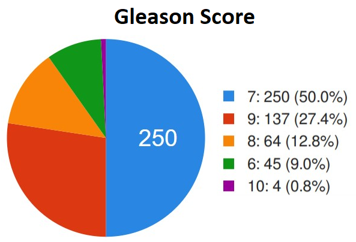
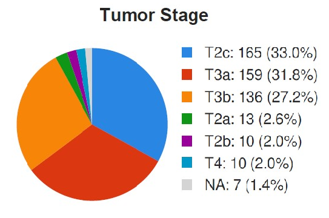
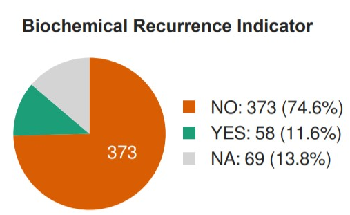

# Prostate Cancer Feature Prediction
Making feature predictions on prostate cancer data, using DNA-methylation and RNA-sequencing data available on cBioPortal. Target features predicted are gleason score, tumor-stage and tumor recurrence.

# Environment and Libraries
The code is implemented in Python 3 with the help of the following modules - 
1. Pandas
2. Sci-kit Learn
3. Imblearn
4. Matplotlib
5. Mpl_toolkits
6. Pprint

All packages can be installed using `pip install <package_name>`

# Files
There are two files in the repository - `prostate_cancer.py` and `feature_processing.py`. The prostate_cancer file contains the main function where execution begins and the feature_processing file contains the separate pipelines used for each of the target features.

# Background 
Prostate Cancer is a carcinogenic disease affecting the prostate gland in men. When compared to other types of cancer, prostate cancer is extremely slow and may not show symptoms for several years. Therefore it manages to slip under the radar. Although tackling this issue is out of the scope of this project, it aims to detect the presence of prostate cancer once patients' data has been collected. This implementation uses DNA and RNA data avaliable at [cBioPortal](https://www.cbioportal.org/study/summary?id=prad_tcga). 

# Data
There are two main datasets - data collected from the methylation tests done on a patient's DNA and their RNA sequencing data. The third dataset contains clinical records of the patients (their files at the hospital). The clinical records contain a lot of information including the three target features for every patient. The DNA and RNA data is used to make predictions on these target features. 

The distribution of values in the target features, is captured in the following pie-charts - 

# Implementation Details
To run the program you will need the datafiles from [here](https://www.cbioportal.org/study/summary?id=prad_tcga). There are two download links on the page, one for the DNA and RNA data ([direct download link](http://download.cbioportal.org/prad_tcga.tar.gz)) and one for the clinical data. Once downloaded, you can change the `filepath` variable in `prostate_cancer.py` to the path of the extracted data.

In the main function in `prostate_cancer.py`, a control variable `mode` determines how much text is output when the program is run. The default setting is on "partial" but setting `mode` to "show" paints a picture of the data as it is modified and updated step-by-step. Running the code will open up four plots, three of which are interactive 3D plots showing the spread of our targets with respect to lower-dimensional DNA data. 

The machine learning pipeline used is as follows - 
1. Feature selection (from DNA and RNA data) (select k-best features, using variance thresholds, selecting features using models, chi-square test)
2. Resampling, upsampling and downsampling data for imbalanced dataset.
3. Dimensionality reduction of training data (PCA, LDA - both can be toggled on or off in `feature_processing.py`)
4. Classifier (SVM, Random Forest, Naïve Bayes', K-Nearest Neighbors)

# Notes 
Machine learning is a quickly expanding field and is useful in several unrelated domains including health and medicine. There are many things that must be considered before we start trusting machines with lives. In addition to moral dilemmas there are also legal and societal aspects that have to be figured out. Still, this is no reason to refuse intelligent machines, especially since they have the potential to be more effecient than humans in certain areas.
